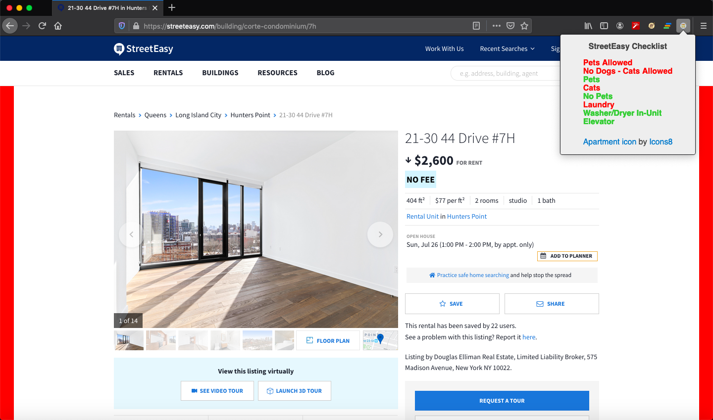

# StreetPeasy

### Video Presentation:

Coming soon...

### Published Browser Extension:

Coming soon...

### Description:

Browser extension that retrieves data regarding the description, highlights, and amenities of a given listing on [StreetEasy.com](https://streeteasy.com), parses it, and checks it against a predetermined checklist.

MVP completed in a day for a solo project.

### Tech Stack:

Built using Vanilla JavaScript, HTML, and CSS.

### Dev Team:

- Tal Luigi ([LinkedIn](https://www.linkedin.com/in/talluigi) | [GitHub](https://github.com/luigilegion))
